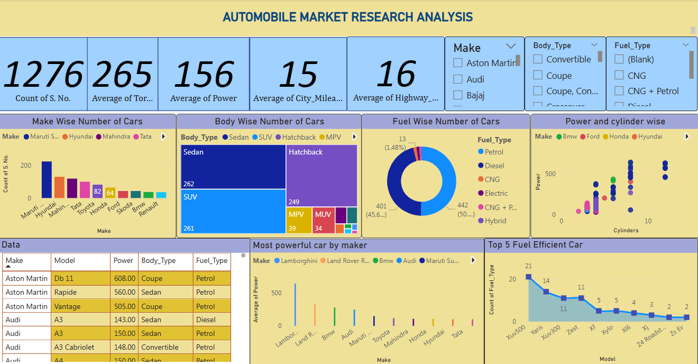

🚗 Automobile Market Research Analysis Dashboard

This project is a comprehensive Power BI Dashboard developed for visualizing and analyzing a dataset of over 1200 cars from various manufacturers. The dashboard provides insights into trends related to fuel type, body style, power, mileage, torque, and more.

📊 Project Overview
This dashboard helps in:

Understanding the distribution of car models by make, body type, and fuel type.

Analyzing performance metrics like power, torque, and mileage.

Identifying the most powerful cars by manufacturer.

Highlighting the top fuel-efficient models.

Providing correlations between power and engine cylinders.

📁 Files Included
Car_Data.xlsx – Contains the raw dataset used for analysis.

Car_Data Dictionary.xlsx – A data dictionary explaining each column in the dataset.

dashboard.png – Image of the final dashboard created in Power BI.

README.md – Documentation for this repository.

📌 Key Insights
Total cars analyzed: 1276

Top 3 manufacturers by count: Maruti Suzuki, Hyundai, Mahindra

Most common fuel type: Petrol

Most common body type: Sedan

Top powerful make: Lamborghini

Top fuel-efficient models: XUV500, Yaris, XUV300

📈 Dashboard Features
Interactive filters for Make, Body Type, and Fuel Type.

Pie and bar charts for categorical analysis.

Power vs Cylinders scatter plot.

Treemap and bar charts for visual comparison.

Separate views for fuel efficiency and engine power trends.

🛠 Tools Used
Power BI Desktop – For data visualization and dashboard creation.

Microsoft Excel – For data preparation and cleanup.

🧠 How to Use
Clone this repository.

Open the Power BI file (if available) or use the dataset in Excel to create your own dashboard.

Explore different visuals and insights.

bash
Copy
Edit
git clone [https://github.com/your-username/automobile-market-analysis.git](https://github.com/RojuChitrakar/Automobile-market-analysis?tab=readme-ov-file)
Note: Power BI dashboard file (.pbix) is not uploaded in this version. You can recreate it using the provided Excel file and dashboard screenshot as a reference.

📬 Contact
For any queries or suggestions, feel free to connect:

📧 Email: [rojuchit04@gmail.com]

